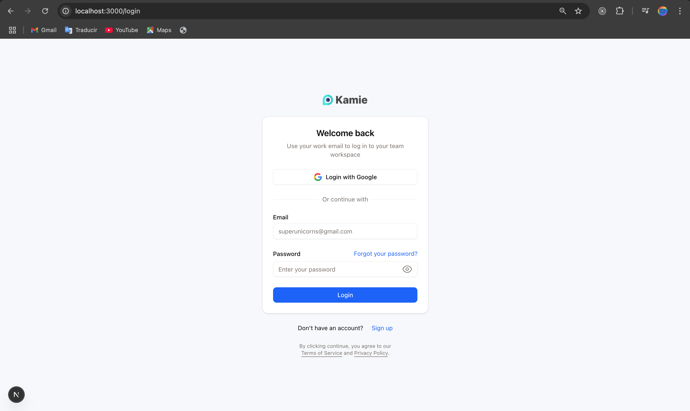

##  Next Auth Sistem

This is a page made with "better auth" authentication, neon serverless database and drizzle sql, also uses typescript, react, shadcn, and tailwind css for styling.

is a complete authentication sistem.



## Built With

#### Front-End:

- typescript
- react
- shadcn
- tailwind

#### Back-End:

- better auth
- resend
- drizzle
- neon

## Getting Started

To get a local copy up and running follow these simple example steps.

- Go to the main page of te repo.
- Press the ```Code``` button and get the repo link.
- Clone it using git.

## Authors
**Cecilia Benitez**

- [@Ceci007](https://github.com/Ceci007)


## Contributing

Contributions, issues and feature requests are welcome!

Feel free to check the [issues page](https://github.com/Ceci007/next-auth-sistem/issues).

## License

This project is [FIUNA](https://www.ing.una.py/FIUNA3/) licensed.